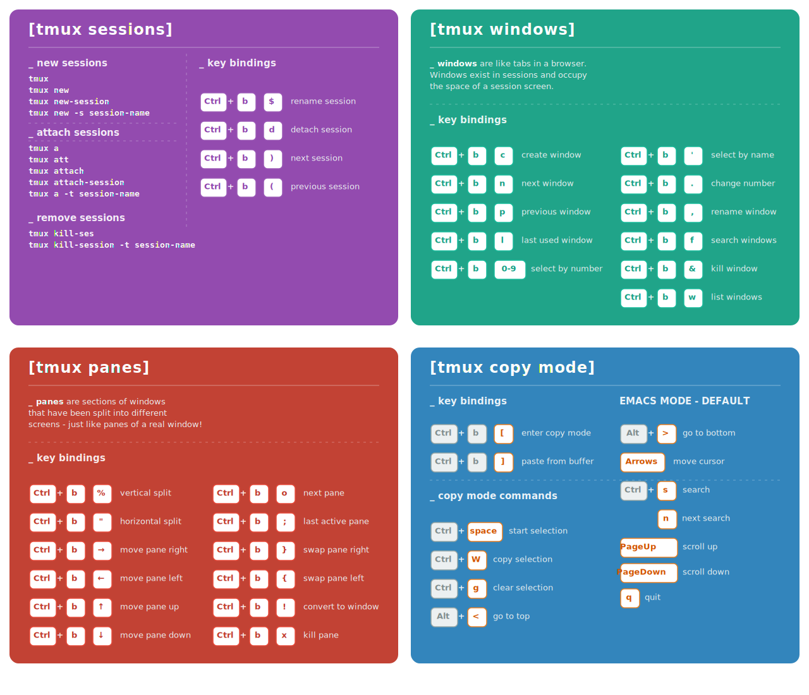

Table of Contents

1. [Session Management](#session-management)
2. [Key Bindings](#key-bindings)
	1. [Sessions & General](#sessions--general)
	2. [Windows (Tabs)](#windows-tabs)
	3. [Panes (Splits)](#panes-splits)
	4. [Resizing Panes](#resizing-panes)
	5. [Sync Panes](#sync-panes)
3. [Copy Mode](#copy-mode)
	1. [Navigation (Vi Mode)](#navigation-vi-mode)
4. [Configuration Examples (.tmux.conf)](#configuration-examples-tmuxconf)
5. [Links](#links)



## Session Management

| Action                          | Command                                                                                       |
|:------------------------------- |:--------------------------------------------------------------------------------------------- |
| **Start new session**           | `tmux`                                                                                        |
| **Start new session with name** | `tmux new -s myname`                                                                          |
| **Attach to last session**      | `tmux a` (or `at`, `attach`)                                                                  |
| **Attach to named session**     | `tmux a -t myname`                                                                            |
| **List sessions**               | `tmux ls`                                                                                     |
| **Kill named session**          | `tmux kill-session -t myname`                                                                 |
| **Kill all sessions**           | `tmux ls \| grep : \| cut -d. -f1 \| awk '{print substr($1, 0, length($1)-1)}' \| xargs kill` |
## Key Bindings

**Prefix:** `Ctrl+b` (default)

### Sessions & General

| Key | Action |
| :--- | :--- |
| `:new` | New session |
| `s` | List sessions |
| `$` | Rename session |
| `d` | Detach from session |
| `t` | Show big clock |
| `?` | List shortcuts |
| `:` | Enter command prompt |

### Windows (Tabs)

| Key | Action |
| :--- | :--- |
| `c` | Create window |
| `w` | List windows |
| `n` | Next window |
| `p` | Previous window |
| `f` | Find window |
| `,` | Rename window |
| `&` | Kill window |

### Panes (Splits)

| Key     | Action                   |
|:------- |:------------------------ |
| `%`     | Vertical split           |
| `"`     | Horizontal split         |
| `o`     | Swap panes               |
| `q`     | Show pane numbers        |
| `x`     | Kill pane                |
| `+`     | Break pane into window   |
| `-`     | Restore pane from window |
| `Space` | Toggle between layouts   |
| `z`     | Toggle pane zoom         |
| `{`     | Move current pane left   |
| `}`     | Move current pane right  |
### Resizing Panes

You can resize panes using the command prompt (`Prefix` + `:`) or key bindings if configured.

**Command Line:**
```bash
resize-pane -D 10  # Down
resize-pane -U 10  # Up
resize-pane -L 10  # Left
resize-pane -R 10  # Right
```

### Sync Panes

Toggle synchronizing keystrokes to all panes in the current window.

```bash
# Toggle synchronization
Prefix + :setw synchronize-panes
```

## Copy Mode

Enter copy mode with `Prefix` + `[`.
Exit copy mode with `Enter`.

### Navigation (Vi Mode)

To enable vi keys: `setw -g mode-keys vi`

| Function | Vi Key | Emacs Key |
| :--- | :--- | :--- |
| **Back to indentation** | `^` | `M-m` |
| **Clear selection** | `Escape` | `C-g` |
| **Copy selection** | `Enter` | `M-w` |
| **Cursor down** | `j` | `Down` |
| **Cursor left** | `h` | `Left` |
| **Cursor right** | `l` | `Right` |
| **Cursor up** | `k` | `Up` |
| **Cursor to bottom line** | `L` | |
| **Cursor to middle line** | `M` | `M-r` |
| **Cursor to top line** | `H` | `M-R` |
| **Delete entire line** | `d` | `C-u` |
| **Delete to end of line** | `D` | `C-k` |
| **End of line** | `$` | `C-e` |
| **Goto line** | `:` | `g` |
| **Half page down** | `C-d` | `M-Down` |
| **Half page up** | `C-u` | `M-Up` |
| **Next page** | `C-f` | `Page down` |
| **Previous page** | `C-b` | `Page up` |
| **Next word** | `w` | `M-f` |
| **Previous word** | `b` | `M-b` |
| **Paste buffer** | `p` | `C-y` |
| **Quit mode** | `q` | `Escape` |
| **Scroll down** | `C-Down` or `J` | `C-Down` |
| **Scroll up** | `C-Up` or `K` | `C-Up` |
| **Search again** | `n` | `n` |
| **Search backward** | `?` | `C-r` |
| **Search forward** | `/` | `C-s` |
| **Start of line** | `0` | `C-a` |
| **Start selection** | `Space` | `C-Space` |
## Configuration Examples (.tmux.conf)

```bash
# Mouse support
set -g mouse on

# Set the default terminal mode to 256color mode
set -g default-terminal "screen-256color"

# Enable activity alerts
setw -g monitor-activity on
set -g visual-activity on

# Center the window list
set -g status-justify centre

# Use Vi keys in copy mode
setw -g mode-keys vi
```
## Links

* [tmux: Productive Mouse-Free Development](http://pragprog.com/book/bhtmux/tmux)
* [How to reorder windows](http://superuser.com/questions/343572/tmux-how-do-i-reorder-my-windows)
